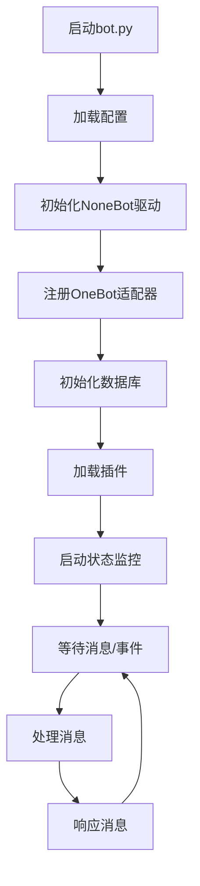
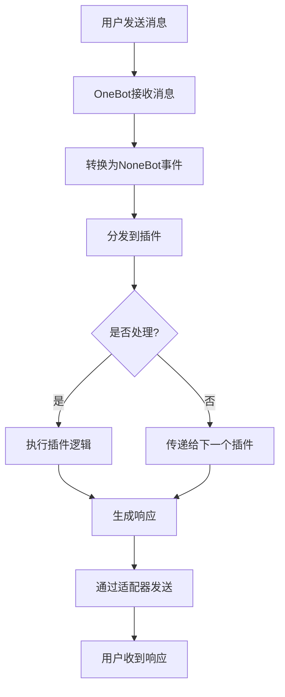
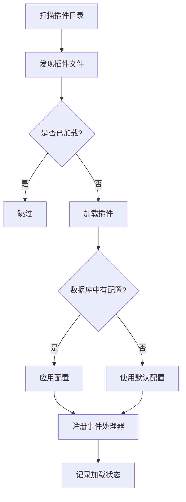
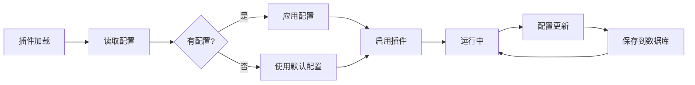
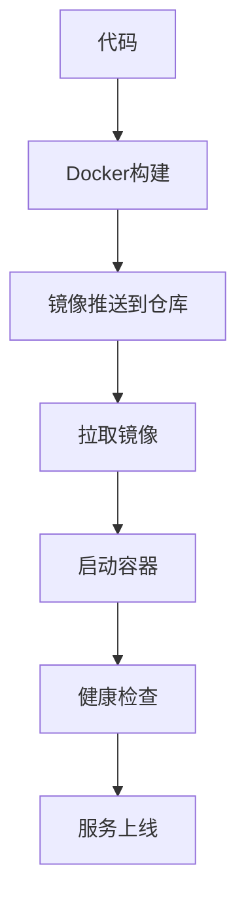

# NoneBot通用聊天机器人 - 业务蓝图

> 生成时间: 2026-01-20

## 1. 项目概述

### 1.1 项目背景

NoneBot通用聊天机器人是一个基于Python NoneBot2框架的通用聊天机器人平台，一期对接NTQQ平台（通过NapCatQQ或Lagrange.OneBot），旨在提供标准化的消息收发、事件处理和插件扩展功能。

### 1.2 项目目标

- 提供稳定、高效的聊天机器人框架
- 支持OneBot V11协议规范
- 实现完整的消息类型和事件类型支持
- 提供灵活的插件系统
- 支持配置持久化和状态监控

### 1.3 项目范围

**一期范围（当前版本）**：
- 对接NTQQ平台（NapCatQQ/Lagrange.OneBot）
- OneBot V11协议支持
- 基础消息收发功能
- 事件处理机制
- 插件管理系统
- 数据库持久化（SQLite/MySQL）
- 配置管理（YAML + 环境变量）
- 日志系统（loguru）
- 状态监控和API

**二期规划（待定）**：
- 多平台适配器扩展（Telegram、微信等）
- 插件市场
- Web管理后台
- 数据统计分析

---

## 2. 核心业务流程

### 2.1 机器人启动流程



**步骤说明**：
1. 加载配置（YAML + 环境变量）
2. 初始化NoneBot驱动（FastAPI）
3. 注册OneBot V11适配器
4. 初始化数据库连接（SQLite/MySQL）
5. 加载插件并注册事件处理器
6. 启动状态监控（定期检查连接状态）
7. 等待并处理消息/事件

### 2.2 消息处理流程



### 2.3 插件加载流程



---

## 3. 系统架构

### 3.1 整体架构

```
┌─────────────────────────────────────────────────────────┐
│                     用户层                               │
│   QQ用户 / NTQQ客户端                                    │
└────────────────────┬────────────────────────────────────┘
                     │ OneBot V11协议
┌────────────────────┴────────────────────────────────────┐
│                   适配器层                               │
│   OneBot V11 Adapter (WebSocket + HTTP API)             │
└────────────────────┬────────────────────────────────────┘
                     │
┌────────────────────┴────────────────────────────────────┐
│                   框架层                                 │
│   NoneBot2 + FastAPI Driver                             │
└────────────────────┬────────────────────────────────────┘
                     │
┌────────────────────┴────────────────────────────────────┐
│                  业务服务层                              │
│   ┌──────────────┐  ┌──────────────┐  ┌──────────────┐  │
│   │ Plugin Mgr   │  │ Event Hdlr   │  │ Status Mgr   │  │
│   └──────────────┘  └──────────────┘  └──────────────┘  │
└────────────────────┬────────────────────────────────────┘
                     │
┌────────────────────┴────────────────────────────────────┐
│                  数据层                                  │
│   ┌──────────────┐  ┌──────────────┐  ┌──────────────┐  │
│   │ SQLite/MySQL │  │ Config Files │  │ Log Files    │  │
│   └──────────────┘  └──────────────┘  └──────────────┘  │
└─────────────────────────────────────────────────────────┘
```

### 3.2 模块划分

| 模块 | 路径 | 职责 |
|------|------|------|
| 入口模块 | `bot.py` | 应用入口，初始化各组件 |
| 适配器模块 | `src/adapters/` | OneBot V11适配器配置 |
| 插件管理 | `src/services/plugin_manager.py` | 插件加载、启用/禁用 |
| 事件处理 | `src/services/event_handler.py` | 事件分发和处理 |
| 消息处理 | `src/services/message_handler.py` | 消息处理逻辑 |
| 状态管理 | `src/services/status_manager.py` | 连接状态监控 |
| 状态API | `src/services/status_api.py` | 状态查询API |
| 数据库层 | `src/database/` | 数据库连接、模型、配置 |
| 工具层 | `src/utils/` | 配置加载、日志、重试 |

### 3.3 技术栈

| 类别 | 技术选型 |
|------|---------|
| 语言 | Python 3.9+ |
| 框架 | NoneBot2 |
| 驱动 | FastAPI (~fastapi) |
| 适配器 | nonebot-adapter-onebot (OneBot V11) |
| 数据库 | SQLite / MySQL |
| ORM | SQLAlchemy 2.0+ |
| 配置管理 | Pydantic 2.0+ + PyYAML + python-dotenv |
| 日志 | loguru |
| 测试框架 | pytest + pytest-asyncio |
| 部署 | Docker + Docker Compose |

---

## 4. 数据架构

### 4.1 数据库表结构

#### 插件配置表 (`plugin_config`)

```sql
CREATE TABLE plugin_config (
    id INTEGER PRIMARY KEY AUTOINCREMENT,
    plugin_name TEXT NOT NULL UNIQUE,
    config_json TEXT NOT NULL,
    enabled INTEGER DEFAULT 1,
    created_at TIMESTAMP DEFAULT CURRENT_TIMESTAMP,
    updated_at TIMESTAMP DEFAULT CURRENT_TIMESTAMP
);
```

**字段说明**：
- `plugin_name`: 插件名称（唯一标识）
- `config_json`: 插件配置（JSON格式）
- `enabled`: 是否启用（1-启用，0-禁用）
- `created_at`: 创建时间
- `updated_at`: 更新时间

### 4.2 数据流



---

## 5. 接口定义

### 5.1 OneBot V11协议接口

#### WebSocket接口

- **正向WebSocket**: `ws://127.0.0.1:3001`
  - 用于接收消息和事件
  - 双向通信

#### HTTP API接口

- **API根路径**: `http://127.0.0.1:3000`
- **主要API**:
  - `send_msg` - 发送消息
  - `get_msg` - 获取消息
  - `get_group_info` - 获取群信息
  - `get_friend_list` - 获取好友列表

### 5.2 状态API接口

- **接口**: `GET /api/status`
- **响应示例**:
```json
{
  "running": true,
  "connected": true,
  "connection_method": "websocket",
  "plugins_loaded": 5,
  "last_check": "2026-01-20T10:30:00Z",
  "last_error": null
}
```

---

## 6. 外部依赖

### 6.1 基础设施

| 组件 | 类型 | 用途 |
|------|------|------|
| NTQQ | 第三方应用 | QQ平台接入 |
| NapCatQQ | 协议适配器 | OneBot V11协议转换 |
| SQLite/MySQL | 数据库 | 配置持久化 |

### 6.2 下游服务

- HTTP API服务（OneBot提供）
- WebSocket服务（OneBot提供）

### 6.3 Python依赖

详见 `requirements.txt` 文件。

---

## 7. 配置管理

### 7.1 配置文件优先级

```
环境变量 > config.yaml > 默认值
```

### 7.2 主要配置项

- `driver`: 驱动类型（~fastapi）
- `log`: 日志配置（级别、文件路径、轮转）
- `adapters`: 适配器配置（API地址、WebSocket地址、Token）
- `database`: 数据库配置（类型、连接信息）
- `plugins`: 插件配置（目录、自动重载）
- `retry`: 重试配置（次数、间隔）
- `status`: 状态监控配置（检查间隔）

---

## 8. 部署架构

### 8.1 本地部署

```bash
python bot.py
```

### 8.2 Docker部署

```bash
docker build -t nonebot-chatbot:latest .
docker-compose up -d
```

### 8.3 部署流程



---

## 9. 扩展规划

### 9.1 短期优化

- 完善插件文档
- 增加更多单元测试
- 性能优化
- 错误处理增强

### 9.2 长期规划

- 多平台适配器（Telegram、Discord等）
- Web管理后台
- 插件市场
- 集群化部署
- 消息队列集成

---

## 10. 附录

### 10.1 参考资料

- [NoneBot2官方文档](https://nonebot.dev/)
- [OneBot协议文档](https://github.com/botuniverse/onebot-11)
- [NapCatQQ项目](https://github.com/NapNeko/NapCatQQ)

### 10.2 项目文档

- 快速开始: `快速开始.md`
- 配置说明: `configs/config.yaml`
- API文档: 待补充

---

> 文档版本: v1.0
> 最后更新: 2026-01-20
