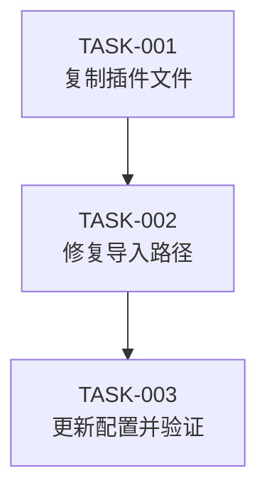

# 迁移 nonebot_plugin_xiuxian_2 插件 - 任务总览

## 概述

| 属性 | 内容 |
|------|------|
| 需求来源 | 用户需求：将 `nonebot_plugin_xiuxian_2` 从虚拟环境迁移到项目本地 |
| 技术方案 | 使用项目现有的迁移工具和插件管理机制 |
| 任务总数 | 3 个 |
| 预估总工时 | 0.5 人天 |
| 创建时间 | 2024-12-19 |

## 任务清单

| 任务ID | 任务名称 | 类型 | 优先级 | 工时 | 依赖 | 状态 |
|--------|----------|------|--------|------|------|------|
| TASK-001 | 复制插件文件到本地目录 | [CFG] | P0 | 0.5h | - | 🔄 |
| TASK-002 | 验证并修复插件导入路径 | [CFG] | P0 | 1h | TASK-001 | ✅ |
| TASK-003 | 更新配置文件并验证注册 | [CFG] | P0 | 0.5h | TASK-002 | ✅ |

## 任务依赖图

## 执行顺序建议

1. **阶段一**：TASK-001 - 复制插件文件到 `src/plugins/xiuxian_2`
2. **阶段二**：TASK-002 - 检查并修复插件内部的导入路径问题
3. **阶段三**：TASK-003 - 确认配置文件已正确更新，验证插件加载

## 插件信息

| 属性 | 内容 |
|------|------|
| 插件名称 | nonebot_plugin_xiuxian_2 |
| 插件版本 | 2.9.2.2 |
| 源路径 | `venv/lib/python3.13/site-packages/nonebot_plugin_xiuxian_2` |
| 目标路径 | `src/plugins/xiuxian_2` |
| 插件类型 | 包结构插件（包含 `__init__.py` 和 `xiuxian/` 子目录） |
| 依赖插件 | `nonebot_plugin_apscheduler` |

## 注意事项

1. **配置文件状态**：`configs/config.yaml` 中已存在 `src.plugins.xiuxian_2` 在启用列表中，但插件文件尚未迁移
2. **数据目录**：插件使用 `data/xiuxian/` 目录存储数据，迁移时需确保该目录存在
3. **依赖检查**：确保 `nonebot_plugin_apscheduler` 已安装或已迁移到本地
4. **导入路径**：插件内部可能使用相对导入，迁移后需要检查是否需要调整

